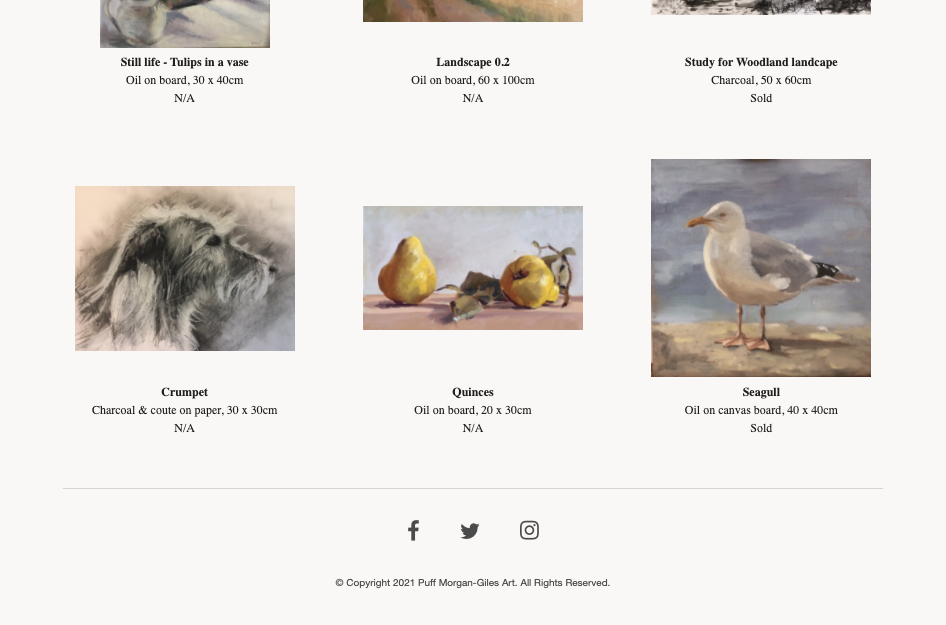
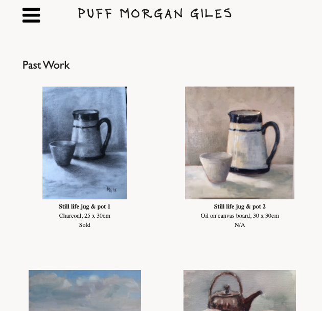

# SEI-Project-4

(named 4.5 to avoid confusion)

# Puff Morgan-Giles Art (1 Week)

A Django and React App

In this project I was tasked with building a full-stack application.

- it had to have used a Python Django API with a Django REST Framwork to serve data from a Postgres database

- Consume the API with a separate front-end built with React

- Be a complete product





URL - Waiting for deployment

### Dependencies:

In the client folder, yarn add:

- axios
- node-sass
- react
- react-dom
- react-hero-carousel
- react-router-dom


## General approach took:

This project gave us the choice of working solo or in groups. Having initially wanted to work on a group project so I could practice my git repo's the majority of the class wanted to do solo projects and therefore I couldn't find anyone to pair with. I started drafting ideas and came up with the thought of making an art website for my mum who teaches art. This seemed like a great idea as I would be able to work with her in deciding how she wanted it to look and what it did and give me practice with interpreting someone else's ideas and delivering something that she would like.

After drawing out a diagram of the relationships I would need I realised that this wasn't going to be the most complicated app in terms of the back-end, however the importance of its finish would be key. Starting on the backend I began to build out the first app, pictures. The challenge here was adding the ability to allow the admin to add pictures from the page and then add them to the images folder. Having done this I began adding the the picture_types. The plan surrounding these was to have the ability to view the images by categories like portraits and new work. This turned out to be very useful as I will explain in more detail later as this also gave me the ability for a picture to have more than one type. While I was aware that I might need a form request in the backend at this point I was still deliberating how I was going to do this and thus I started on front-end.

```JavaScript
// filtering categories
const filteredPictures = newWork ? newWork.filter(picture => {
    let i
    for (i = 0; i < picture.types.length;) {
      if (picture.types[i] === 1) {
        return picture
      } else {
        i++
      }
    }
  }) : null
```

As the primary use of the app was displaying my mums art I thought I would get the pictures showing as soon as possible. Having made responses in the backend for both pictures and types I realised that just using the one for pictures and filtering seemed like the best option. Having asked my mum to get her photos together I gradually was drip fead photos throughout the week which helped break up the coding and make me think more clearly. Once I had them showing on the screen I built my filtering method. This gave me the ability to create all the pages quite quicky as a lot of them used the same structure. Having got these conforming to different screen sizes and built the header and nav I began working on a burger menu. This was a struggle at first as I tried a few different ones but wasn't happy with the finish it was giving me. I then decided on making my own version and was happy with it. I now had the basic app working as the images showed, you could navigate and it dealt with changing sizes.



I then added the painting show page. This brought about the challenge of showing the enquire button based on whether it had a price or not but was able to do this quite quickly. I then decided to add the changing photos on the main new work page. I had always planned for this and was able to do it using React Carousel Hero. While initially trying to map into the option, this didn't work and I had to code each one in individually. I then set about the form. I decided to create it like a post request to the admin page so the admin could see them and manage it from there. I created the enquire_forms app in the backend and then built out the form in the fontend. 

```JavaScript
// Form Post Request

class FormSendView(APIView):

    def post(self, request):
        form_to_create = FormSerializer(data=request.data)
        if form_to_create.is_valid():
            form_to_create.save()
            return Response(form_to_create.data, status=status.HTTP_201_CREATED)
        return Response(form_to_create.errors, status=status.HTTP_422_UNPROCESSABLE_ENTITY)
```

Having spend a bit of time sorting out the error handling I decided to move logic out into seperate components. This was becasue a lot of the pages had identical code and so I moved the header and footer into its own component lke I had done for the nav earlier on. After doing this I wanted to give the admin the ability to change the carousel photos but wondered how I could do this as I had hardcoded each image in. Having explored the ability to delete image from the files and name the new ones the same which didn't seem a good idea I came up with the idea of adding a carousel type and displaying these the same way as the other types throught filtering. Thus the decicion to use picture_types in this way turned out to be a very good idea. After completing this I set about putting finishing touch on the styling and hooking up my mums instagram and related teaching. I also managed to convert her writing into her own font so that I could use it for her page.


Doing a more simple backend as I had no need for users, while limiting the scope of my project, gave me the time needed to really pollish the look of the app. This was always going to be the most important function of an art based website and turned out to very useful as before I think my projects were lacking that pollished look and it was good to get more practice on this and deliver to a high standard. Also working with a sort of client throught the processs was also a very good learning experence.


### Major hurdles and unsolved problems

Major hurdles were managing lots of different sized images and displaying them it lost of changing sizes, focusing on giving the admin compelte control over the content and future content of the app.

In terms of unsolved problems, having the form request being sent to an email adress rather than the admin site, displaying different styles while mapping.


